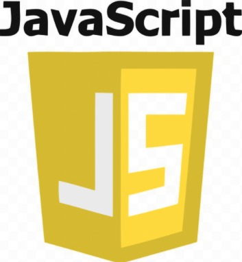

  

<h1 align="center">3 Projetos em JS</h1> 

É um repositorio com 3 projetos feitos em JS realizados no mes 10 de 2021

Tabela de conteúdos
=================
<!--ts-->
   * [Sobre](#Sobre)
   * [Tabela de Conteudo](#tabela-de-conteudo)
   * [Instalação](#Instalação)
   * [Como usar](#como-usar)
      * [Pre Requisitos](#pre-requisitos)
   * [Tecnologias](#tecnologias)
   * [Referencia](#Bonieky)
<!--te-->

<h4 align="center"> 
  🚧  Em desenvolvimento.  🚧
</h4>

## Sobre

+ É um repositorio com 3 projetos feitos em JavaScript realizados no mes 10 de 2021 com o objetivo de treinar o uso do mesmo.

+ Todos os codigos aqui foram feitos seguindo o passo a passo do Bonieky Lacerda em sua live no youtube.

+ Cada projeto corresponde a uma aplicação diferente sendo elas a primeira um formulario a segunda um SlideShow e a terceira uma urna eletronica.

## Tabela de conteudo

- [X] Urna Eletronica
- [X] Slideshow
- [X] Formulario

## Instalação

Para instalar esse repositorio basta digitar:

  git clone https://github.com/Taunt-byte/DESAFIO-3-Projetos-em-JavaScript.git

<i>Lembre se de escolher uma pasta para salva-lo</i>

## Como usar

Basta abrir esse repositorio na IDE de sua escolha que você ja podera usa-lo da forma que achar melhor.

## Pre Requisitos

1) Para instalar esse repositorio o git sera necessario.
2) Recomendo que se tenha uma boa IDE para utilizar esse repositorio por isso recomendo o VScode.

## Tecnologias

<table>
    <tr>
    <td>HTML</td>
    <td>CSS</td>
    <td>JavaScript</td>
    </tr>
    <tr>
    <td>5.*.*</td>
    <td>3.*.*</td>
    <td>5.*.*</td>
    </tr>
</table>

## Bonieky

Como eu disse mais a cima esse codigo foi feito seguindo um tutorial no youtube por isso nada mais justo que deixa-lo aqui um link que vai direto para o video em questão.

  https://www.youtube.com/watch?v=hF_VMWnsY00&list=PLGBXQpt0YO1c1qcaFQEnCw9H1JktEyb-S&index=36&ab_channel=BoniekyLacerda

<i>De resto é isso até a proxima !!</i>